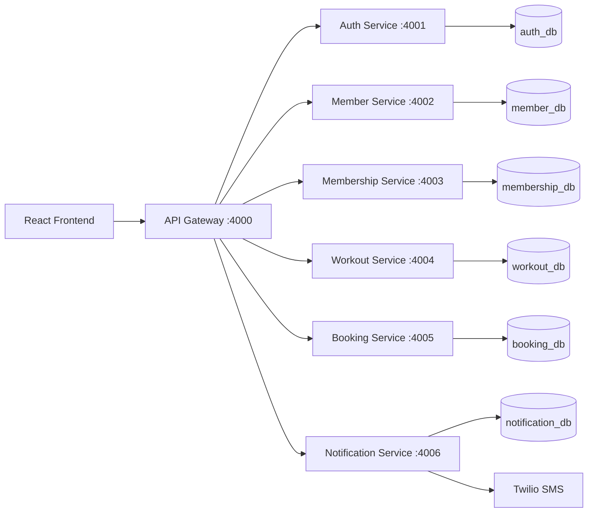

# Fitness & Wellness Microservices App

This project keeps the existing React frontend and migrates the original monolithic backend into a modular microservice architecture with a single API Gateway and dedicated service boundaries for auth, members, memberships, workouts, bookings, and notifications.

## Architecture overview



## Service responsibilities

- API Gateway: single frontend entry point, JWT validation, route proxying, health checks, CORS, rate limiting.
- Auth Service: registration, login, JWT generation, token validation, role enforcement.
- Member Service: member profiles, fitness metadata, profile reads and updates.
- Membership Service: plans, subscription records, membership status.
- Workout Service: workout plans, exercise tracking, member workout history.
- Booking Service: classes, trainers, schedules, booking lifecycle, notification trigger.
- Notification Service: Twilio SMS, notification persistence, status records.

## Project structure

```text
DMBS_Project/
├── backend/                 # reference monolith for migration analysis
├── docs/
│   └── architecture-analysis.md
├── frontend/
│   ├── src/
│   ├── package.json
│   ├── .env.example
│   └── vite.config.js
├── services/
│   ├── api-gateway/
│   │   ├── src/
│   │   ├── test/
│   │   ├── package.json
│   │   ├── .env.example
│   │   ├── Dockerfile
│   │   └── .env.example
│   ├── auth-service/
│   │   ├── src/
│   │   ├── test/
│   │   ├── package.json
│   │   ├── .env.example
│   │   └── Dockerfile
│   ├── member-service/
│   ├── membership-service/
│   ├── workout-service/
│   ├── booking-service/
│   └── notification-service/
├── docker-compose.yml
├── package.json
├── README.md
└── .env.example
```

## Database architecture

Each service owns its own logical database and should not access another service's database directly.

- auth_db
- member_db
- membership_db
- workout_db
- booking_db
- notification_db

In local development, each service supports MySQL configuration with a SQLite fallback for isolated tests. Docker Compose provisions a shared MySQL instance while keeping logical ownership separated by service.

## API endpoint map

### Gateway

- GET /health
- GET /api/health
- POST /api/auth/register
- POST /api/auth/login
- POST /api/auth/validate
- GET /api/auth/me
- GET /api/members
- GET /api/members/:id
- PUT /api/members/:id
- GET /api/members/:id/profile
- GET /api/memberships/plans
- POST /api/memberships
- GET /api/memberships/:id
- PUT /api/memberships/:id
- GET /api/members/:memberId/membership
- GET /api/workouts
- POST /api/workouts
- GET /api/workouts/:id
- PUT /api/workouts/:id
- GET /api/workouts/member/:memberId
- GET /api/bookings
- POST /api/bookings
- GET /api/bookings/:id
- PUT /api/bookings/:id
- GET /api/bookings/member/:memberId
- GET /api/classes
- GET /api/trainers
- GET /api/schedule
- POST /api/notifications
- POST /api/notifications/sms
- GET /api/notifications/member/:memberId

## Authentication flow

1. The React app sends credentials to the API Gateway at `/api/auth/login`.
2. The API Gateway validates the gateway-level request shape and forwards the request to the Auth Service.
3. The Auth Service validates credentials, hashes passwords using bcrypt, and issues a JWT with `userId`, `role`, and `email`.
4. The frontend stores the token and includes it in the `Authorization: Bearer <token>` header.
5. The gateway validates the JWT before proxying downstream service calls.
6. Each downstream service performs its own required authorization checks before executing protected business logic.

## Service communication

The services communicate through REST endpoints, not by sharing a database. For example:

- Booking Service creates a booking.
- It calls Notification Service asynchronously.
- Notification Service persists the delivery record and triggers Twilio SMS if credentials are configured.
- A booking should still remain created even if a notification attempt fails.

## Environment variables

Each service has an `.env.example` file. Example values:

```env
PORT=4001
DB_HOST=localhost
DB_PORT=3306
DB_NAME=auth_db
DB_USER=root
DB_PASSWORD=root
JWT_SECRET=change-me
```

For gateway and downstream service URLs:

```env
AUTH_SERVICE_URL=http://localhost:4001
MEMBER_SERVICE_URL=http://localhost:4002
MEMBERSHIP_SERVICE_URL=http://localhost:4003
WORKOUT_SERVICE_URL=http://localhost:4004
BOOKING_SERVICE_URL=http://localhost:4005
NOTIFICATION_SERVICE_URL=http://localhost:4006
TWILIO_ACCOUNT_SID=
TWILIO_AUTH_TOKEN=
TWILIO_PHONE_NUMBER=
```

## Docker setup

The repo includes a root `docker-compose.yml` file with the gateway, all microservices, and a shared MySQL instance.

```bash
docker compose up --build
```

## Local development commands

```bash
npm install
npm --prefix services/api-gateway install
npm --prefix services/auth-service install
npm --prefix services/member-service install
npm --prefix services/membership-service install
npm --prefix services/workout-service install
npm --prefix services/booking-service install
npm --prefix services/notification-service install

npm run dev
```

The frontend will use the gateway at:

```text
http://localhost:4000/api
```

## Database migration and seed commands

The project keeps the original monolith as a reference while the microservice services use their own logical database ownership. For MySQL deployments, initialize a database for each service and run migrations in each service directory as needed.

```bash
mysql -u root -p
CREATE DATABASE auth_db;
CREATE DATABASE member_db;
CREATE DATABASE membership_db;
CREATE DATABASE workout_db;
CREATE DATABASE booking_db;
CREATE DATABASE notification_db;
```

## Testing commands

```bash
npm --prefix services/api-gateway test
npm --prefix services/auth-service test
npm --prefix services/member-service test
npm --prefix services/membership-service test
npm --prefix services/workout-service test
npm --prefix services/booking-service test
npm --prefix services/notification-service test
```

## Troubleshooting

- If the frontend cannot connect, confirm the gateway is running on port 4000 and the `VITE_API_URL` value still points to `http://localhost:4000/api`.
- If JWT validation fails, confirm the same `JWT_SECRET` value is present in the gateway and the downstream service environment files.
- If a downstream service is unavailable, check the health endpoint, e.g. `http://localhost:4005/health` for the booking service.
- If Twilio SMS is not sending, ensure `TWILIO_ACCOUNT_SID`, `TWILIO_AUTH_TOKEN`, and `TWILIO_PHONE_NUMBER` are configured in the notification service.
- If MySQL connection fails, verify the root password and database names match the environment variables for each service.

## Notes

This migration preserves the React frontend contract while introducing a clean gateway-based service split. The old backend remains in the workspace as a reference implementation and is not removed until the new architecture has been validated end to end.
